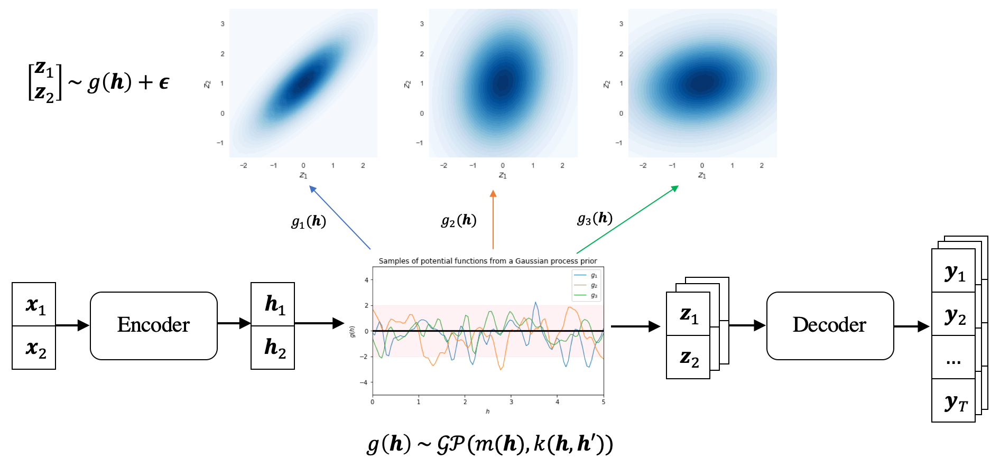

# GP-VAE

This repository provides datasets and code for preprocessing, training and testing models for reproducing the paper (by Choi Saemee & Karl Meisner Jensen in SKKU):

> [Diverse Text Generation via Variational Encoder-Decoder Models with Gaussian Process Priors](http://arxiv.org/abs/2204.01227) <br>
> Wanyu Du, Jianqiao Zhao, Liwei Wang and Yangfeng Ji <br>
> [ACL 2022 6th Workshop on Structured Prediction for NLP](http://structuredprediction.github.io/SPNLP22) <br>





## Basic demo
The following command installs all necessary packages:
```
pip install -r requirements.txt
```
The project was tested using Python 3.6.6.


## Datasets
1. **Twitter URL** includes `trn/val/tst.tsv`, which has the following format in each line:
```
source_sentence \t reference_sentence 
```

## Citation
If you find this work useful for your research, please cite the original paper:

#### Diverse Text Generation via Variational Encoder-Decoder Models with Gaussian Process Priors
```
@article{du2022diverse,
  title={Diverse Text Generation via Variational Encoder-Decoder Models with Gaussian Process Priors},
  author={Du, Wanyu and Zhao, Jianqiao and Wang, Liwei and Ji, Yangfeng},
  journal={arXiv preprint arXiv:2204.01227},
  year={2022},
  url={https://arxiv.org/abs/2204.01227}
}
```
